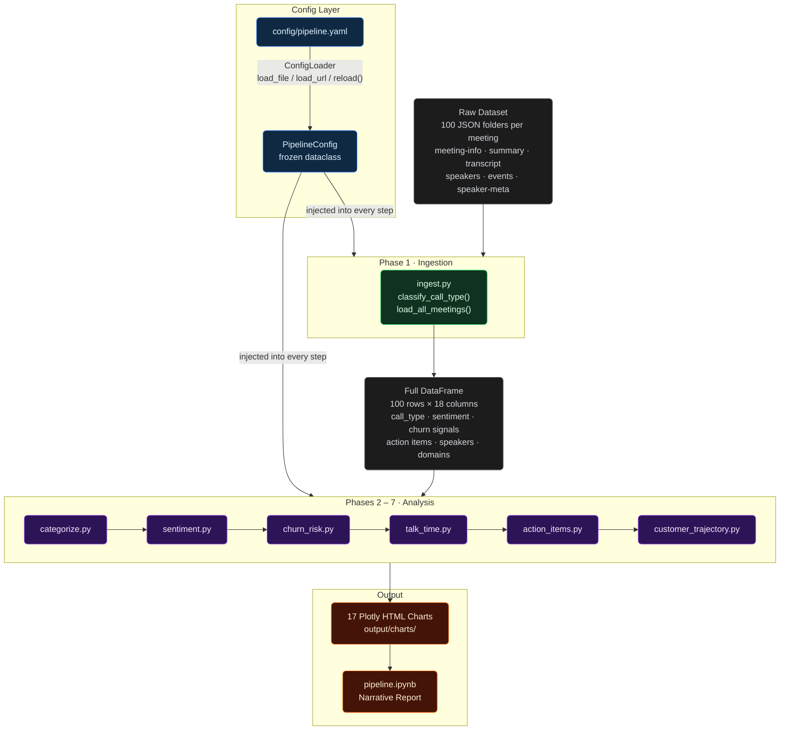
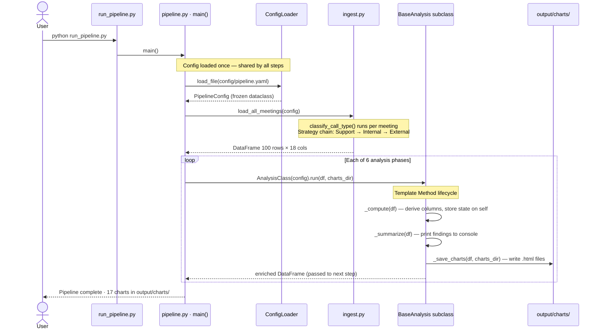

# Transcript Intelligence — Pipeline Architecture

---

## High-Level Architecture

> What the system is: layers, modules, and data flow from raw files to output.

---

## Execution Sequence

> How the system runs: who calls what, in what order, and the Template Method lifecycle inside each analysis step.

---

## Design Patterns

> Why the system is structured this way: the four patterns, their abstract contracts, and their concrete implementations.

```mermaid
flowchart TD
    classDef abstractStyle fill:#1e3a5f,stroke:#60a5fa,color:#dbeafe,font-style:italic
    classDef concreteStyle fill:#14532d,stroke:#4ade80,color:#dcfce7
    classDef chainStyle    fill:#431407,stroke:#fb923c,color:#ffedd5
    classDef tmStyle       fill:#2d1457,stroke:#c084fc,color:#f3e8ff
    classDef ruleStyle     fill:#1c1c2e,stroke:#6b7280,color:#e5e7eb,font-size:12px

    subgraph S1["Strategy A · Call Type Classification  (ingest.py)"]
        direction TB
        CTS["«interface»\nCallTypeStrategy\n+ matches(title, emails) bool\n+ label str"]:::abstractStyle
        SUP["_SupportCaseStrategy\ntitle has 'Support Case' or 'Escalation'"]:::concreteStyle
        INT["_InternalMeetingStrategy\nno external email addresses"]:::concreteStyle
        EXT["_ExternalMeetingStrategy\ncatch-all — always true"]:::concreteStyle
        RULE1["Ordered chain · first match wins\nSupport → Internal → External"]:::ruleStyle
        CTS --> SUP & INT & EXT
        SUP & INT & EXT --> RULE1
    end

    subgraph S2["Strategy B · Topic Categorization  (categorize.py)"]
        direction TB
        CS["«interface»\nCategorizationStrategy\n+ score(topics, summary) dict"]:::abstractStyle
        KW["_TopicKeywordStrategy\nscores raw_topics list against\n8 categories × 80+ keywords"]:::concreteStyle
        SUM["_SummaryTextStrategy\nfallback — scans LLM summary text\nwhen keyword scores are empty"]:::concreteStyle
        RULE2["First non-empty score dict wins"]:::ruleStyle
        CS --> KW & SUM
        KW & SUM --> RULE2
    end

    subgraph COR["Chain of Responsibility · Churn Risk  (churn_risk.py)"]
        direction TB
        RF["«interface»\nRiskFactor\n+ contribution(meetings) float\n+ describe(meetings) str"]:::abstractStyle
        F1["_ChurnSignalFactor"]:::chainStyle
        F2["_NegativeMeetingFactor"]:::chainStyle
        F3["_TechnicalIssueFactor"]:::chainStyle
        F4["_BillingDisputeFactor"]:::chainStyle
        F5["_SupportEscalationFactor"]:::chainStyle
        F6["_SentimentAdjustmentFactor"]:::chainStyle
        RULE3["Total Score = Σ all contributions\nHIGH ≥ 10 · MEDIUM ≥ 5 · LOW < 5"]:::ruleStyle
        RF --> F1 & F2 & F3 & F4 & F5 & F6
        F1 & F2 & F3 & F4 & F5 & F6 --> RULE3
    end

    subgraph TM["Template Method · All Analysis Modules  (base.py)"]
        direction TB
        BA["«abstract»\nBaseAnalysis\n+ run(df, charts_dir)  ← fixed order\n# _compute(df)\n# _summarize(df)\n# _save_charts(df, dir)"]:::abstractStyle
        TCA["TopicCategorizationAnalysis\ncategorize.py"]:::tmStyle
        SA["SentimentAnalysis\nsentiment.py"]:::tmStyle
        CRA["ChurnRiskAnalysis\nchurn_risk.py"]:::tmStyle
        TTA["TalkTimeAnalysis\ntalk_time.py"]:::tmStyle
        AIA["ActionItemAnalysis\naction_items.py"]:::tmStyle
        CTA["CustomerTrajectoryAnalysis\ncustomer_trajectory.py"]:::tmStyle
        RULE4["Lifecycle order is immutable\nSubclasses override steps, never run()"]:::ruleStyle
        BA --> TCA & SA & CRA & TTA & AIA & CTA
        TCA & SA & CRA & TTA & AIA & CTA --> RULE4
    end
```

---

## Phase Reference

### Phase 0 — Configuration (`config.py` + `config/pipeline.yaml`)

| Component                      | Responsibility                              |
| ------------------------------ | ------------------------------------------- |
| `ConfigLoader.load_file(path)` | Read YAML from disk                         |
| `ConfigLoader.load_url(url)`   | Fetch YAML from HTTP/HTTPS (stdlib only)    |
| `ConfigLoader.reload()`        | Hot-reload from last source without restart |
| `PipelineConfig`               | Frozen dataclass — single source of truth   |
| `ChurnWeights`                 | 6 risk-factor weights                       |
| `ChurnTiers`                   | HIGH / MEDIUM score thresholds              |

**Externalised values:** `aegis_domain`, talk thresholds, follow-up window, trajectory minimums, trend delta, all churn weights, tier thresholds, Plotly color maps, sentiment label order, full 8-category topic taxonomy (~80 keywords).

---

### Phase 1 — Ingestion (`ingest.py`)

| Function                                    | Output                                             |
| ------------------------------------------- | -------------------------------------------------- |
| `classify_call_type(title, emails, config)` | `"customer_support"` / `"internal"` / `"external"` |
| `load_all_meetings(dataset_path, config)`   | DataFrame — 100 rows × 18 columns                  |

---

### Phase 2 — Topic Categorization (`categorize.py`)

8 canonical categories mapped across ~80 keywords. Charts: `categorization_distribution.html`

---

### Phase 3 — Sentiment Analysis (`sentiment.py`)

6 charts: Violin by call type · Weekly trend · Heatmap · Churn signal matrix · Score distribution · Call-type facet bar.

---

### Phase 4 — Churn Risk Scorecard (`churn_risk.py`)

Risk tiers: **HIGH** ≥ 10 · **MEDIUM** ≥ 5 · **LOW** < 5. Charts: scorecard bar · tier distribution.

---

### Phase 5 — Talk Time (`talk_time.py`)

`aegis_talk_ratio` vs benchmarks (support ≥ 0.65, external ≥ 0.60). Charts: benchmark bar · outlier scatter.

---

### Phase 6 — Action Items (`action_items.py`)

Parses `"Owner: task"` format. Detects orphaned meetings (action items with no follow-up within `followup_window_days`). Charts: burden bar · orphaned meetings.

---

### Phase 7 — Customer Trajectory (`customer_trajectory.py`)

Requires ≥ 3 meetings per customer. Trend delta ≥ 0.30 = Improving / ≤ -0.30 = Declining / else Stable. Charts: classification bar · per-customer line · heatmap.